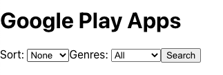
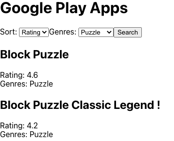

# google-play-client

A Thinkful assignment. This project was bootstrapped with [Create React App](https://github.com/facebook/create-react-app) and utilizes [google-play-server](https://github.com/7424243/google-play-server).

## Available Scripts

`npm start`

## Screenshots

## Summary

This React App allows users to perform a search for apps within Google Play. They can provide some parameters, such as 'sort' or 'genres' or, by default, they are able to search all. They are then shown the results of their search which display the name of the app, the rating, and the genre. This app utilizes [google-play-server](https://github.com/7424243/google-play-server), which I also built when initially learning backend development.

## Built With

* JavaScript
* Node
* Express
* React
